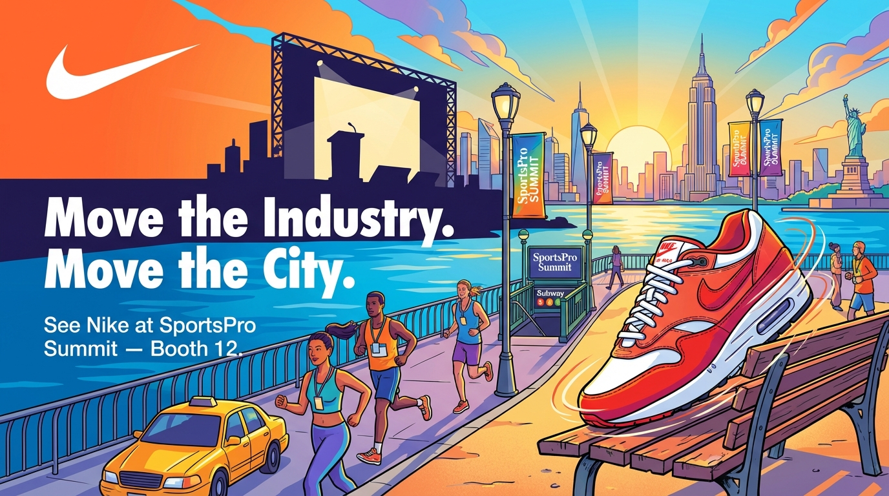
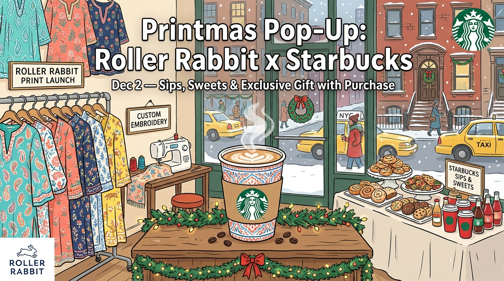
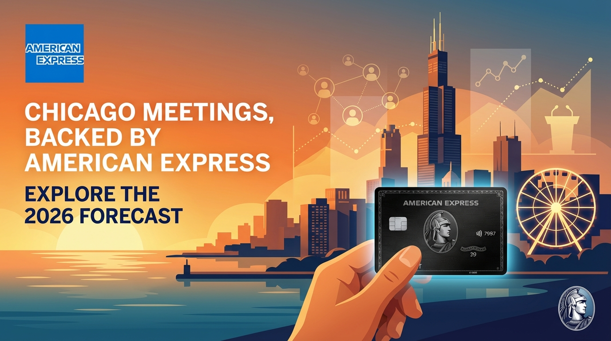
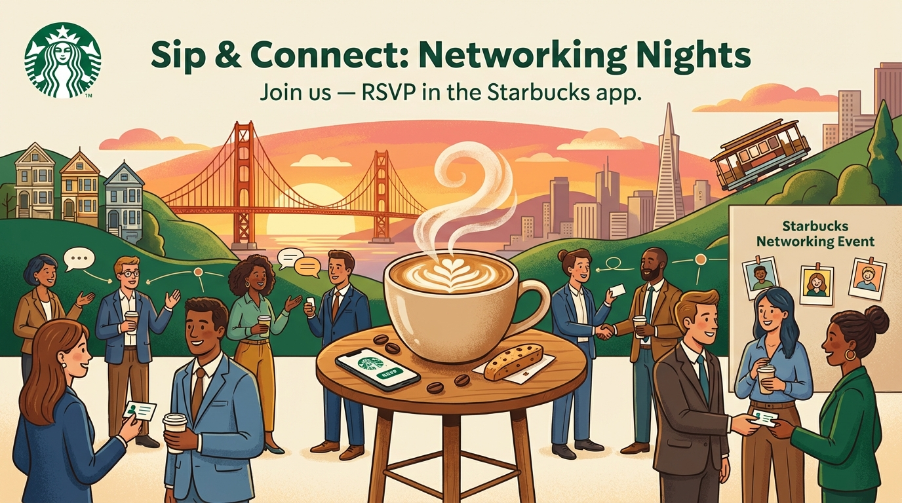

# Fortune 500 Marketing Agent: Partnerships

A FastAPI service that generates partnership marketing campaign posters by researching brands and events using Tavily, creating marketing briefs with OpenAI, and generating visual assets with Google Gemini. It automatically **excludes brand-owned domains** from search results to focus on new partnership opportunities and includes specific **event details (dates, times, locations)** in the generated posters.

## Example Outputs

Here are some example partnership campaign posters generated by the service:

### Nike × New York City


### Starbucks × New York City


### American Express × Chicago


### Tinder × New York


### Starbucks × San Francisco


Each poster includes brand-specific visual elements, city landmarks, event details if available, and partnership-focused messaging.

---

## 🚀 Technical and Business Statement

Our approach is a **multi-agent, chained workflow** built on a FastAPI backend, designed for rapid, data-driven campaign ideation.

The core technical innovation is the implementation of a **proactive, LLM-guided domain exclusion strategy**. We use **OpenAI** to identify and exclude official brand domains from **Tavily's** web search, forcing the agent to focus exclusively on **third-party sources**. This guarantees the discovery of **untapped, external partnership opportunities**, which is a critical business value.

The process automates the campaign cycle:
1.  **Research & Exclusion**: Tavily performs advanced searches using `search_depth="advanced"` and **full page content extraction** (`include_raw_content="markdown"`) to gather deep data on brand positioning and local events.
2.  **Strategic Briefing**: OpenAI synthesizes this data into a structured marketing brief, formulating a partnership angle and including all critical event details.
3.  **Visual Asset Generation**: **Google Gemini** transforms the brief into a high-quality, marketing-ready visual poster.

This automation slashes the campaign cycle from days to minutes, translating directly into **significant time savings and cost efficiency** for marketing teams, while providing **fresh market intelligence** from third-party perspectives.

---

## Features

-   **End-to-End Automation**: Streamlines the entire workflow from market research to visual asset generation.
-   **Brand Research**: Uses Tavily to research brand voice and positioning, always excluding brand-owned domains.
-   **Event Discovery**: Finds upcoming events in target cities, optimized with geographic and time-based filtering to ensure relevance.
-   **LLM-Powered Domain Exclusion**: Uses OpenAI to dynamically identify and filter brand domains from search.
-   **Marketing Brief Generation**: Creates structured briefs with partnership angles and precise visual prompts.
-   **Poster Generation**: Generates high-quality partnership campaign posters using Google Gemini image generation, ensuring all essential event details are visually present.

---

## Prerequisites

-   Python 3.10+
-   API keys: **Tavily API Key**, **OpenAI API Key**, **Gemini API Key**.

## Setup

1.  Clone the repository:
    ```bash
    cd tavily-fde-assignment
    ```
2.  Create and activate a virtual environment:
    ```bash
    python -m venv venv
    source venv/bin/activate  # Windows: venv\Scripts\activate
    ```
3.  Install dependencies:
    ```bash
    pip install -r requirements.txt
    ```
4.  Create a `.env` file with your API keys:
    ```env
    TAVILY_API_KEY=your_tavily_api_key
    OPENAI_API_KEY=your_openai_api_key
    GEMINI_API_KEY=your_gemini_api_key
    ```

## Run

Start the FastAPI server:
```bash
python app.py
````

*The API will be available at `http://localhost:8000`.*

-----

## API Endpoints

### 1\. POST `/partnership-campaign` (Generate Campaign Poster)

Generates a partnership marketing campaign poster for a brand in a target city.

**Request Body Example:**

```json
{
  "brand": "Nike",
  "city": "New York City",
  "num_events": 1,
  "visual_style": "bright illustration style with clear readable text"
}
```

**Response Example:**

```json
{
  "brand": "Nike",
  "city": "New York City",
  "events": [
    {
      "title": "New York Fashion Week",
      "hook": "Premier fashion event in the heart of NYC",
      "partnership_angle": "Nike's athletic innovation meets high fashion",
      "url": "[https://example.com/event](https://example.com/event)",
      "date": "September 6, 2024",
      "time": "7:00 PM",
      "location": "Lincoln Center, New York, NY"
    }
  ],
  "brand_summary": "Nike embodies athletic excellence and innovation...",
  "visual_prompt": "A vibrant poster featuring...",
  "overlay_copy": "Join Nike at New York Fashion Week | Get Tickets",
  "poster_path": "marketing_assets/nike_new_york_city_abcd1234.png"
}
```

*The generated poster PNG is saved to the `marketing_assets/` directory.*


## Technologies Used

- **FastAPI**: Web framework for the API
- **`langchain-tavily`**: Tavily integration for web search and event discovery (Tavily Search)
- **`langchain-openai`**: OpenAI integration for LLM-powered operations
- **google-genai**: Google Gemini integration for image generation
- **LangGraph**: For the web research agent workflow

## Project Structure

```
tavily-fde-assignment/
├── app.py                  # Main FastAPI application
├── requirements.txt        # Python dependencies
├── README.MD               # This file
├── .env                    # API keys (populate this)
└── marketing_assets/       # Store generated poster images
```
